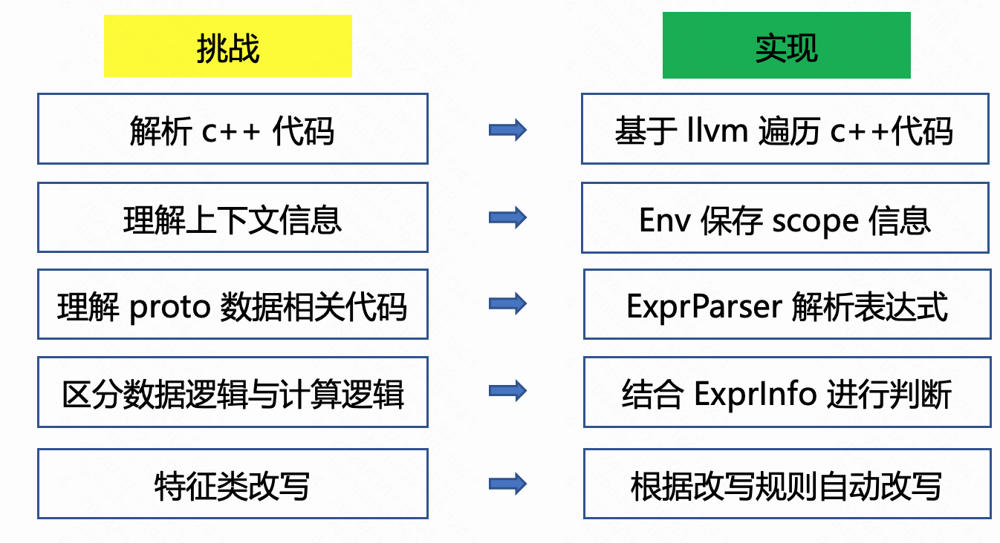

# 思路

有了 `llvm` 解析 `c++` 代码为基础，针对之前总结的问题，我们就可以按如下思路来解决自动改写的问题:



1. 利用 `llvm` 解析 `c++` 代码, 获取代码对应的完整的 `ast` 结构, 即语法树结构。
2. 理解代码中的上下文信息，如是 `if` 语句还是循环语句，是函数调用还是变量定义，并讲这些 `scope` 相关信息保存在专门设计的 `Env` 中。
3. 利用 `protobuf` 提供的功能，对 `AdJointLabeledLog` 中的节点建立一棵 `ProtoNode` 树，保存所有 `proto` 字段节点的信息，
   用于自动对应 `kv` 数据, 用于理解 `proto` 数据相关的代码。
4. 遍历 `ast` 结构，解析表达式，并将解析的结果保存在 `Env` 中。结合 `ProtoNode` 中以及上下文信息，就可以判断是数据相关逻辑还是计算相关逻辑。
5. 结合以上解析代码所得到的信息，根据规则进行改写:
    - 对于数据相关逻辑，结合 `ProtoNode` 树中的信息，区分是哪种类型的数据，进一步判断属于哪种改写规则。
    - 结合不同类型的改写规则，进行自动改写，并用改写后的代码替换原有的代码。
    - 将改写后的结果按特征类的逻辑，写入到新的文件中。

## 示例

以下我们通过一个简单的示例来展示这个思路。

`adlog` 特征类: teams/ad/ad_algorithm/feature/fast/impl/extract_ad_delay_label.h

代码如下:

```cpp
class ExtractAdDelayLabel : public FastFeature {
 public:
    ExtractAdDelayLabel() : FastFeature(FeatureType::DENSE_ITEM) {}

  virtual void Extract(const AdLog& adlog, size_t pos,
                       std::vector<ExtractResult>* result) {
    if (adlog.item_size() <= pos) {
      return;
    }
    auto& item = adlog.item(pos);
    if ((item.type() == AD_DSP || item.type() == NATIVE_AD) && item.has_label_info()) {
      for (auto & attr : item.label_info().label_info_attr()) {
        if (attr.name_value() ==
            ::auto_cpp_rewriter::LabelInfoCommonAttr_Name_BACKEND_LABEL_MATCH_CALIBRATION_TAG) {
          AddFeature(0, attr.bool_value(), result);
        }
      }
    }
  }

 private:
  DISALLOW_COPY_AND_ASSIGN(ExtractAdDelayLabel);
};
```

`llvm` 来解析 `c++` 代码可以获取代码对应的完整的 `ast` 结构。

我们只截取了部分主要结构, 其他部分以 `...` 代替, 详细结构可以参考 [ast](solution/sub_modules/ast.md):

```cpp
CXXRecordDecl 0x7f909280fcc8 </home/liuzhishan/ast/teams/ad/ad_algorithm/feature/fast/impl/extract_ad_delay_label.h:9:1, line:31:1> line:9:7 referenced class ExtractAdDelayLabel definition
...
|-public 'FastFeature':'ks::ad_algorithm::FastFeature'
|-CXXRecordDecl 0x7f909280fe28 <col:1, col:7> col:7 implicit referenced class ExtractAdDelayLabel
|-AccessSpecDecl 0x7f909280feb8 <line:10:2, col:8> col:2 public
|-CXXConstructorDecl 0x7f909280ff48 <line:11:5, col:67> col:5 used ExtractAdDelayLabel 'void ()' implicit-inline
| |-CXXCtorInitializer 'FastFeature':'ks::ad_algorithm::FastFeature'
| | `-CXXConstructExpr 0x7f9092810b60 <col:29, col:64> 'FastFeature':'ks::ad_algorithm::FastFeature' 'void (FeatureType, size_t)'
...
| `-CompoundStmt 0x7f9092810bc0 <col:66, col:67>
|-CXXMethodDecl 0x7f90928103c0 <line:13:3, line:27:3> line:13:16 used Extract 'void (const AdLog &, size_t, std::vector<ExtractResult> *)' virtual implicit-inline
| |-Overrides: [ 0x7f909534e860 FastFeature::Extract 'void (const AdLog &, size_t, std::vector<ExtractResult> *)' ]
| |-ParmVarDecl 0x7f9092810010 <col:24, col:37> col:37 used adlog 'const AdLog &'
| |-ParmVarDecl 0x7f9092810088 <col:44, col:51> col:51 used pos 'size_t':'unsigned long'
| |-ParmVarDecl 0x7f90928102d8 <line:14:24, col:52> col:52 used result 'std::vector<ExtractResult> *'
| `-CompoundStmt 0x7f9092815d20 <col:60, line:27:3>
|   |-IfStmt 0x7f9092810cf8 <line:15:5, line:17:5>
|   | |-BinaryOperator 0x7f9092810cb0 <line:15:9, col:30> 'bool' '<='
|   | | |-ImplicitCastExpr 0x7f9092810c98 <col:9, col:25> 'size_t':'unsigned long' <IntegralCast>
|   | | | `-CXXMemberCallExpr 0x7f9092810c40 <col:9, col:25> 'int'
...
|   | | `-ImplicitCastExpr 0x7f9092810c80 <col:30> 'size_t':'unsigned long' <LValueToRValue>
|   | |   `-DeclRefExpr 0x7f9092810c60 <col:30> 'size_t':'unsigned long' lvalue ParmVar 0x7f9092810088 'pos' 'size_t':'unsigned long'
|   | `-CompoundStmt 0x7f9092810ce0 <col:35, line:17:5>
|   |   `-ReturnStmt 0x7f9092810cd0 <line:16:7>
|   |-DeclStmt 0x7f9092811008 <line:18:5, col:33>
|   | `-VarDecl 0x7f9092810d38 <col:5, col:32> col:11 used item 'const ItemAdaptorBase &' cinit
...
|   `-IfStmt 0x7f9092815d00 <line:19:5, line:26:5>
|     |-BinaryOperator 0x7f90928113f0 <line:19:9, col:84> 'bool' '&&'
|     | |-ParenExpr 0x7f9092811360 <col:9, col:59> 'bool'
|     | | `-BinaryOperator 0x7f9092811340 <col:10, col:50> 'bool' '||'
...
|     `-CompoundStmt 0x7f9092815ce8 <col:87, line:26:5>
|       `-CXXForRangeStmt 0x7f9092815878 <line:20:7, line:25:7>
|         |-<<<NULL>>>
|         |-DeclStmt 0x7f9092811828 <line:20:26>
...
|         |-DeclStmt 0x7f9092815170 <col:24>
...
|         |-DeclStmt 0x7f9092815188 <col:24>
...
|         |-CXXOperatorCallExpr 0x7f9092815538 <col:24> 'iterator':'google::protobuf::internal::RepeatedPtrIterator<const auto_cpp_rewriter::LabelInfoCommonAttr>' lvalue '++'
...
|         | `-DeclRefExpr 0x7f9092815478 <col:24> 'const_iterator':'google::protobuf::internal::RepeatedPtrIterator<const auto_cpp_rewriter::LabelInfoCommonAttr>' lvalue Var 0x7f9092811898 '__begin3' 'const_iterator':'google::protobuf::internal::RepeatedPtrIterator<const auto_cpp_rewriter::LabelInfoCommonAttr>'
|         |-DeclStmt 0x7f90928115e8 <col:12, col:61>
|         | `-VarDecl 0x7f9092811580 <col:12, col:24> col:19 used attr 'const auto_cpp_rewriter::LabelInfoCommonAttr &' cinit
...
|         `-CompoundStmt 0x7f9092815cd0 <col:63, line:25:7>
|           `-IfStmt 0x7f9092815cb0 <line:21:9, line:24:9>
|             |-BinaryOperator 0x7f9092815a98 <line:21:13, line:22:29> 'bool' '=='
|             | |-CXXMemberCallExpr 0x7f9092815928 <line:21:13, col:29> 'int64_t':'long'
|             | | `-MemberExpr 0x7f90928158f8 <col:13, col:18> '<bound member function type>' .name_value 0x15afc2c0
...
|             `-CompoundStmt 0x7f9092815c98 <col:91, line:24:9>
|               `-CXXMemberCallExpr 0x7f9092815c18 <line:23:11, col:50> 'void'
|                 |-MemberExpr 0x7f9092815b10 <col:11> '<bound member function type>' ->AddFeature 0x1f69a1e0
...
|-AccessSpecDecl 0x7f90928104b0 <line:29:2, col:9> col:2 private
...
  `-CompoundStmt 0x7f909281a720 <col:7>
```

可以看出，这个 `ast` 结构中包含了所有的信息，包含变量定义、函数定义、类定义、宏定义、模板定义等。这个结构还是挺复杂的。
不同节点的 `ast` 通过一种递归的结构组织起来。

我们对其中的节点进行一些简单的解释。

比如 `CXXRecordDecl` 表示整个特征类的定义, `CXXMethodDecl` 表示方法的定义, `CXXForRangeStmt` 表示 `for` 循环的定义。
详细的接口则可以查询 `llvm` 的文档可以了解。如 `CXXRecordDecl` 的详细接口可以参考 [CXXRecordDecl](https://clang.llvm.org/doxygen/classclang_1_1CXXRecordDecl.html)。

`adlog` 是通过参数传递到特征类的，因此其 `ast` 节点是固定的 `DeclRefExpr`, 并且 `name` 是 `adlog`。
我们通过判断一个表达式是否是来自 `adlog` 来判断其是否是数据相关逻辑。如下所示:

```cpp
  if (item.type() == AD_DSP || item.type() == NATIVE_AD) {
    ...
  }
```

对于表达式 `item.type()`, 我们通过递归的寻找其父节点来判断其根节点是否是 `adlog`。当发现其是 `adlog` 字段后，
我们根据 `ProtoNode` 中的信息，获取其字段类型是 `int`。并且可以知道 `kv` 数据中其 `key` 是 `adlog.item.type`。

如下所示:

```cpp
  auto enum_item_type = BSFieldEnum::adlog_item_type;
  int64_t item_type = BSFieldHelper::GetSingular<int64_t>(*bs, enum_item_type, pos);
```

而对于 `common info` 中的数据，我们根据其字段路径和枚举名可以确定其 `kv` 数据，之后再将原来的 `for` 循环遍历
`common_info_attr` 列表的逻辑去掉，直接实现具体的计算逻辑即可。

最终的 `bslog` 特征类见: teams/ad/ad_algorithm/bs_feature/fast/impl/bs_extract_ad_delay_label.cc

如下所示:

```cpp
BSExtractAdDelayLabel::BSExtractAdDelayLabel() : BSFastFeature(FeatureType::DENSE_ITEM) {
  attr_metas_.emplace_back(BSFieldEnum::adlog_item_type);
  attr_metas_.emplace_back(BSFieldEnum::adlog_item_label_info_exists);
  attr_metas_.emplace_back(BSFieldEnum::adlog_item_label_info_label_info_attr_key_1006);
}

void BSExtractAdDelayLabel::Extract(const BSLog& bslog, size_t pos, std::vector<ExtractResult>* result) {
  auto bs = bslog.GetBS();
  if (bs == nullptr) {
    return;
  }

  auto enum_info_exists = BSFieldEnum::adlog_item_label_info_exists;
  bool info_exists = BSFieldHelper::GetSingular<bool>(*bs, enum_info_exists, pos);

  auto enum_item_type = BSFieldEnum::adlog_item_type;
  int64_t item_type = BSFieldHelper::GetSingular<int64_t>(*bs, enum_item_type, pos);

  auto enum_key_1006 = BSFieldEnum::adlog_item_label_info_label_info_attr_key_1006;
  bool key_1006 = BSFieldHelper::GetSingular<bool>(*bs, enum_key_1006, pos);

  auto enum_key_1006_exists = BSFieldEnum::adlog_item_label_info_label_info_attr_key_1006;
  bool key_1006_exists = BSFieldHelper::HasSingular<bool>(*bs, enum_key_1006_exists, pos);

  if ((item_type == bs::ItemType::AD_DSP || item_type == bs::ItemType::NATIVE_AD) && info_exists) {
    if (key_1006_exists) {
      AddFeature(0, key_1006, result);
    }
  }
}
```