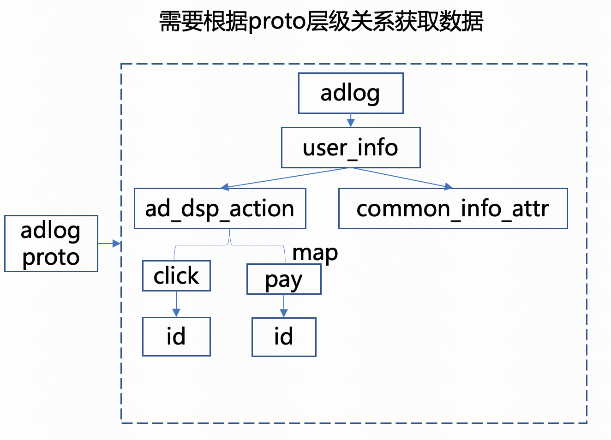

# proto_parser

如前文所述，原始的 `adlog` 数据是 `protobuf` 定义的嵌套结构数据，如下图所示



我们可以利用 `protobuf` 提供的反射功能，根据 `adlog` 节点的定义构造一棵 `ProtoNode` 树。

详细代码实现可参考: `convert/proto_parser`。

如下部分为构建 `ProtoNode` 树的核心逻辑:

```cpp
std::unique_ptr<AdlogNode> ProtoParser::build_adlog_tree_from_descriptor(const Descriptor* descriptor,
                                                                         const std::string& name,
                                                                         int index,
                                                                         int degree,
                                                                         const std::string& prefix,
                                                                         bool is_repeated) {
  if (is_descriptor_common_info(descriptor)) {
    return build_adlog_tree_common_info(descriptor, name, index, degree, prefix);
  }

  std::string type_name = descriptor->name();
  if (is_repeated) {
    type_name = std::string("repeated ") + type_name;
  }
  auto res = std::make_unique<AdlogNode>(name, type_name, index);

  for (int i = 0; i < descriptor->field_count(); i++) {
    const auto field = descriptor->field(i);

    if (field->name() == "serialized_reco_user_info") {
      // 不需要映射，直接获取原数据使用。
      auto node = std::make_unique<AdlogNode>(field->name(), field->type_name(), field->index());
      res->add_child(field->name(), std::move(node));
    } else if (const EnumDescriptor* enum_type = field->enum_type()) {
      add_enum(res.get(), enum_type, field->type_name(), field->name());
    } else if (field->is_map()) {
      // 必须在 message 判断之前, map 也是 message
      const auto key_field = field->message_type()->FindFieldByName("key");
      const auto value_field = field->message_type()->FindFieldByName("value");

      // value 是普通字段，直接当做叶子节点。
      if (is_basic_type(value_field->type())) {
        std::ostringstream oss_type_name;
        oss_type_name << "map<" << key_field->type_name() << ", " << value_field->type_name() << ">";
        auto node = std::make_unique<AdlogNode>(field->name(), oss_type_name.str(), field->index());

        res->add_child(field->name(), std::move(node));
      } else {
        // 中间的 map 按 key 的值展开，因此不需要关心 key，只需要按 value 继续展开。
        // 如 ActionDetail 类型是 map<int, SimpleAdDspInfos>, field->name 为 key。
        // 但是在获取 adlog_path 时候必须传入 key 的值。
        auto node = std::move(build_adlog_tree_from_descriptor(value_field->message_type(),
                                                               field->name(),
                                                               field->index(),
                                                               degree + 1,
                                                               prefix + "." + field->name(),
                                                               is_repeated));
        res->add_child(field->name(), std::move(node));
      }
    } else if (field->is_repeated()) {
      if (is_basic_type(field->type())) {
        auto node = std::make_unique<AdlogNode>(field->name(),
                                                std::string("repeated ") + field->type_name(),
                                                field->index());
        res->add_child(field->name(), std::move(node));
      } else {
        auto node = std::move(build_adlog_tree_from_descriptor(field->message_type(),
                                                               field->name(),
                                                               field->index(),
                                                               degree + 1,
                                                               prefix + "." + field->name(),
                                                               true));
        res->add_child(field->name(), std::move(node));
      }
    } else if (field->type() == FieldDescriptor::TYPE_MESSAGE) {
        auto node = std::move(build_adlog_tree_from_descriptor(field->message_type(),
                                                               field->name(),
                                                               i,
                                                               degree + 1,
                                                               prefix + "." + field->name(),
                                                               is_repeated));
      res->add_child(field->name(), std::move(node));
    } else if (is_basic_type(field->type())) {
      auto node = std::make_unique<AdlogNode>(field->name(), field->type_name(), field->index());
      res->add_child(field->name(), std::move(node));
    } else {
      LOG(INFO) << "ignore, field->type(): " << field->type_name()
                << ", field_name: " << field->name();
    }
  }

  return res;
}

```
