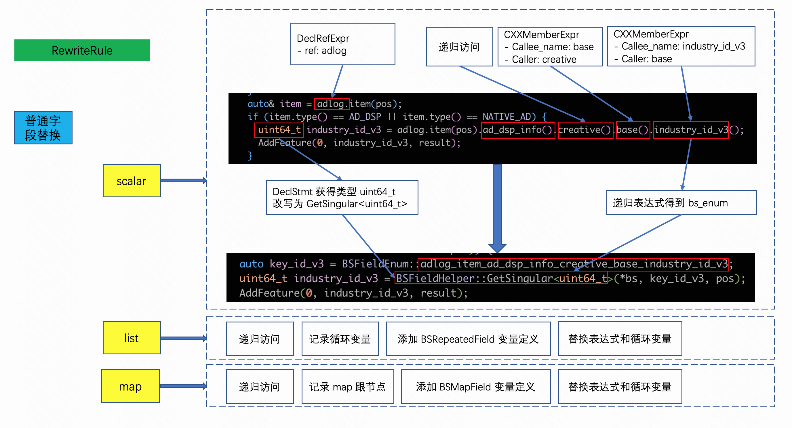
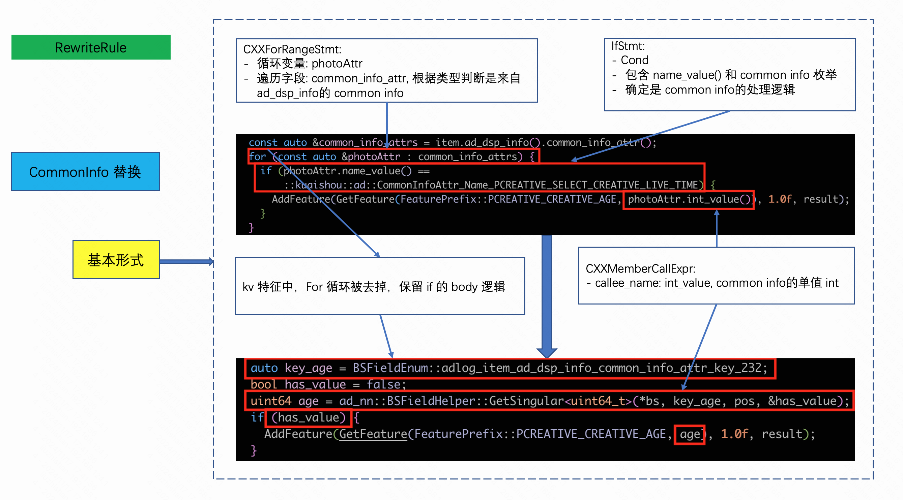
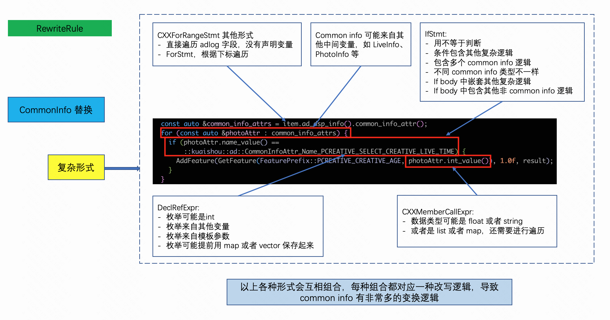
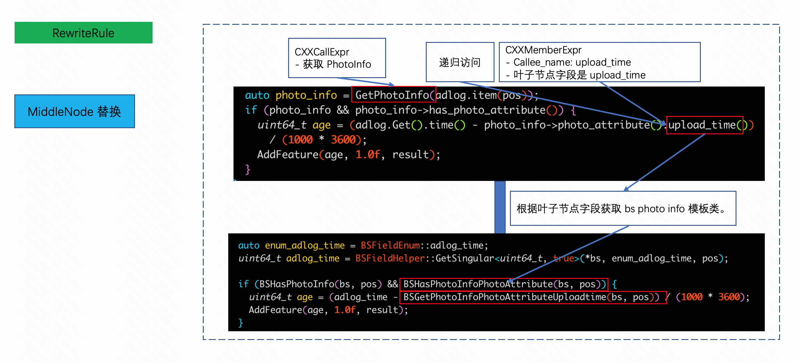

# rewrite

详细实现可参考:
- `convert/matcher_callback`。
- `convert/rule`。

有了之前步骤得到的各种信息，就可以进行代码改写了。详细改写逻辑在 `convert/rule` 中实现，每种改写规则会对应一个类。
如 `ActionDetailRule` 用于处理 `action_detail` 的改写。

以下结合一些具体示例展示一些改写规则。

普通字段替换

简单 `common info` 替换

复杂 `common info` 替换

中间节点替换

