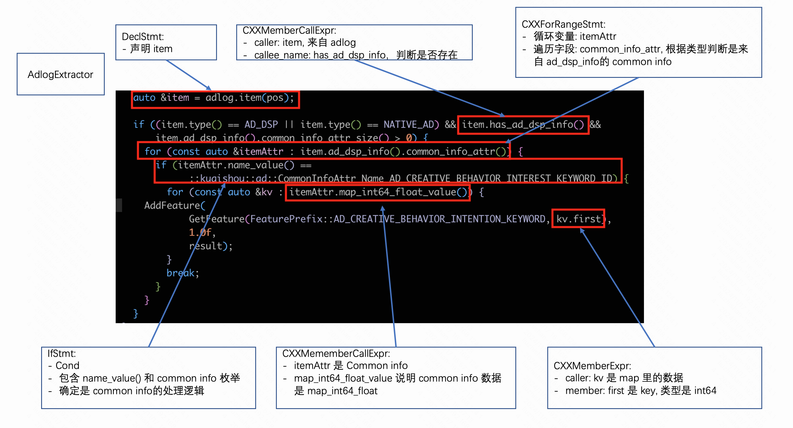

# visitor

详细实现可参考: `convert/visitor`。

有了解析得到的 `ast` 后，我们就需要遍历这些节点。基本思路就是递归访问 `ast` 节点，并根据表达式不同的类型
调用不同的处理逻辑。

如下所示:



以下是部分 `visitor` 逻辑示例:

```cpp
template<typename Handler>
void ExtractMethodVisitor::recursive_visit(clang::Stmt *stmt,
                                           Handler* handler_ptr,
                                           Env* env_ptr) {
  if (!stmt) {
    return;
  }

  if (clang::CompoundStmt* compound_stmt = dyn_cast<clang::CompoundStmt>(stmt)) {
    for (clang::CompoundStmt::body_iterator start = compound_stmt->body_begin();
         start != compound_stmt->body_end();
         start++) {
      recursive_visit(*start, handler_ptr, env_ptr);
      handler_ptr->process(*start, env_ptr);
    }

  } else if (clang::DeclStmt* decl_stmt = dyn_cast<clang::DeclStmt>(stmt)) {
    env_ptr->update(decl_stmt);
    if (clang::VarDecl* var_decl = dyn_cast<clang::VarDecl>(decl_stmt->getSingleDecl())) {
      if (var_decl->hasInit()) {
        recursive_visit(var_decl->getInit(), handler_ptr, env_ptr);
      }
      if (const clang::Expr* init_expr = var_decl->getAnyInitializer()) {
        recursive_visit(const_cast<clang::Expr*>(init_expr), handler_ptr, env_ptr);
      }
    }

    handler_ptr->process(decl_stmt, env_ptr);

    // decl_stmt 比较特殊, decl_info 只维持当前变量, 访问完当前 decl_stmt 后立即销毁。
    env_ptr->clear_decl_info();

  } else if (clang::CXXConstructExpr* cxx_construct_expr = dyn_cast<clang::CXXConstructExpr>(stmt)) {
    ...
  } else if (clang::BinaryOperator* binary_operator = dyn_cast<clang::BinaryOperator>(stmt)) {
    ...
  } else if (...) {
    ...
  } else {
    LOG(INFO) << "unsupported stmt, trated as string: " << stmt_to_string(stmt);
  }
}
```
